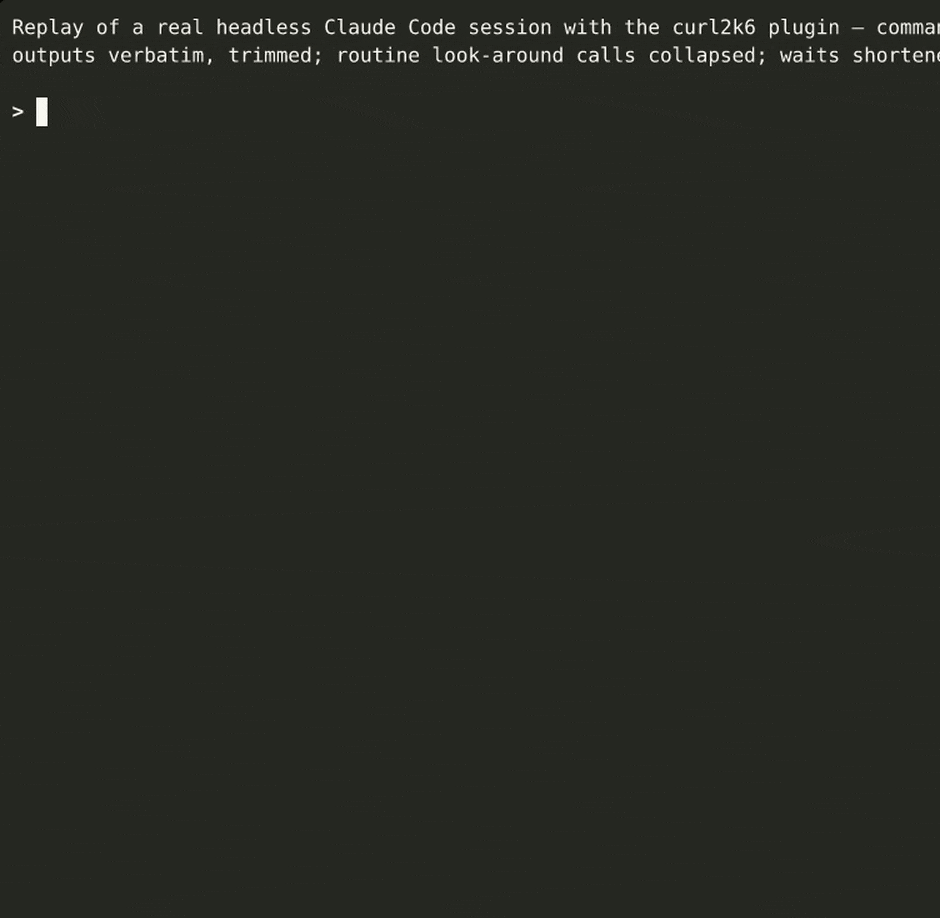

# curl2k6

**Give Claude a curl — get a k6 load test, a report, and an honest answer to "did this release make it slower?"**

A [Claude Code](https://docs.claude.com/en/docs/claude-code/overview) plugin (skill + agent) for QA and performance engineers:

```
curl ──▶ k6 test ──▶ LOW / MEDIUM / HIGH runs ──▶ metrics ──▶ report (.md / Confluence) ──▶ regression verdict vs. last run
          (local or your CI)         (k6 summary + Prometheus, Grafana, Datadog, Elasticsearch, InfluxDB)
```

[](https://github.com/<your-github-username>/curl2k6/actions/workflows/test.yml)




<sub>"Did the new release get slower?" — replay of a real headless Claude Code session with this plugin: the skill finds the previous report, re-runs the same profile, and `compare.mjs` flags the regression. Commands and outputs are verbatim, trimmed for length.</sub>

## Why not just ask Claude to write a k6 script?

Writing the script is the easy part. What goes wrong in real load testing is everything around it — and that's what this plugin encodes:

- **Regression verdicts are computed, not "eyeballed" by an LLM.** `scripts/compare.mjs` applies fixed rules (p95/p99 worse by >20%, success rate down by >1 pp, timeout share up by >0.1 pp — configurable) and is unit-tested down to the floating-point trap where `(0.84 − 0.7) / 0.7` is `20.000000000000004%`.
- **It refuses apples-to-oranges comparisons.** Different environment, target rate or planned duration → *not like-for-like*; a field missing in an old report → *cannot be confirmed*. Flags are shown but never called a regression.
- **Missing data stays missing.** Unknown values are `null` / `n/a` — never silently 0.
- **Production safety is not optional.** Read-only by default, a separate explicit confirmation for every production run, automatic stop when results look like an incident rather than load degradation, no "one more run to double-check".
- **Battle-tested gotchas:** "launcher" CI jobs that go green before k6 finishes, stale profile variables (LOW silently running as HIGH), Datadog nanoseconds vs. seconds, `text` vs `.keyword` in Elasticsearch, `jslib.k6.io` blocked in CI.
- **Secrets never leave env vars.** Tokens from your curl are never written into tests, commits, reports or prompts.

## What a report looks like

From [`examples/reports/`](examples/reports/) — real k6 runs against the bundled demo service, before and after a simulated bad release:

| Profile | Metric | Previous | Current | Δ | |
|---|---|---|---|---|---|
| LOW | success rate | 99.21% | 98.41% | −0.79 pp | ✓ |
| LOW | p95 ms | 29.22 | 42.11 | +44.1% | ⚠ regression |
| MEDIUM | success rate | 100.00% | 98.80% | −1.20 pp | ⚠ regression |
| HIGH | p95 ms | 35.26 | 93.13 | +164.1% | ⚠ regression |

(−0.79 pp is below the 1 pp threshold, so it is shown but not flagged.)

Every report has the same structure (verdict, per-profile results, 2xx-only latency, server side, comparison, runs, data sources, queries) and ends with a machine-readable **Raw numbers** block that the next run compares against. → [baseline report](examples/reports/items-api-2026-10-08-local-baseline.md) · [regression report](examples/reports/items-api-2026-10-08-local-regression.md)

## Try it in 2 minutes (no Claude needed)

Requires Node.js ≥ 22 and [k6](https://grafana.com/docs/k6/latest/set-up/install-k6/).

```bash
git clone https://github.com/<your-github-username>/curl2k6.git && cd curl2k6
bash examples/run-demo.sh          # baseline → "bad release" → tables + comparison + verdict
```


## Install in Claude Code

```
/plugin marketplace add <your-github-username>/curl2k6
/plugin install curl2k6@curl2k6
```

<details><summary>Manual install (without the plugin system)</summary>

```bash
mkdir -p ~/.claude/skills ~/.claude/agents
cp -R plugins/curl2k6/skills/curl2k6 ~/.claude/skills/
cp plugins/curl2k6/agents/curl2k6-runner.md ~/.claude/agents/
```
</details>

## Use

```
/curl2k6 here's the curl: curl -H 'Authorization: Bearer <TOKEN>' https://api.stage.example.com/v2/items?limit=50
— stage, LOW/MEDIUM/HIGH, report to load-reports/ and Confluence
```

Or just paste a curl and ask for a load test. Later, *"we shipped a release — re-run the load test and tell me if it got slower"* (in any language) picks up the existing test and the last report. Claude asks what it needs in one block (repo, environment, local or CI, metrics backends, profiles, report destination, where tokens live), shows the draft test, opens an MR, finds the previous report, runs the profiles, and writes the report. On CI, the long part runs in the background via the `curl2k6-runner` agent.

**Gate a pipeline on regressions:**
```bash
node plugins/curl2k6/skills/curl2k6/scripts/compare.mjs \
  --prev load-reports/items-api-2026-10-01-stage.md --curr out/raw.json --format text --fail-on-regression
```
`--format text` prints an aligned, coloured table for CI logs; the default `md` is the report section.

## Supported

| | |
|---|---|
| **Run** | locally · GitLab CI (proven in practice) · Azure DevOps (pipeline template + `az` recipe; verified on a real Azure DevOps organization — Microsoft-hosted and autoscaled self-hosted pools, variable-group secrets, Azure DevOps Wiki report — [checklist](docs/azure-devops.md)) · GitHub Actions / Jenkins (generic instructions) |
| **Metrics** | k6 summary (always, no backend needed) · Prometheus / VictoriaMetrics / Thanos / Mimir · Grafana · Datadog (MCP or API) · Elasticsearch / Kibana / OpenSearch · InfluxDB |
| **Reports** | markdown file · Confluence or any wiki Claude has a connector for · Azure DevOps Wiki (via `az devops wiki`) — written in English by default |

What has and hasn't been verified against real systems: [GUIDE §14](docs/GUIDE.md#14-what-has-and-hasnt-been-verified).

## Repo layout

```
plugins/curl2k6/
├── skills/curl2k6/
│   ├── SKILL.md                 the skill: questions, conventions, safety rules, reporting flow
│   ├── templates/               test-template.js · summary.js · report.md · azure-pipelines.yml
│   ├── scripts/                 to-raw.mjs · compare.mjs   (zero dependencies)
│   └── references/              metrics-backends.md (query recipes per backend) · ci-azure-devops.md
└── agents/curl2k6-runner.md     the background runner for CI
examples/                        demo service · generated test example · example reports · Azure DevOps demo pipeline
tests/                           npm test — unit tests for the scripts · azure/ — offline Azure Pipelines checks
docs/GUIDE.md                    full guide
```

## Development

```bash
npm test                         # unit tests (node --test, no install step)
bash examples/run-demo.sh low    # quick end-to-end check
```

Issues and PRs welcome — especially real-world reports from GitHub Actions / Jenkins and backends not yet verified.

## License

[MIT](LICENSE) © 2026 Talat Gurbanbayov
