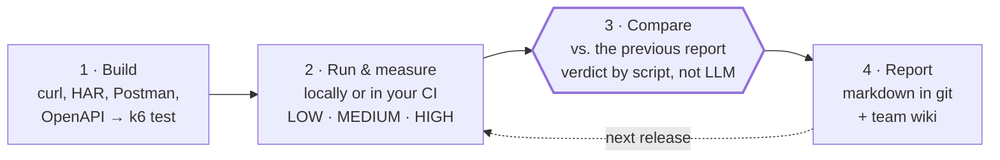
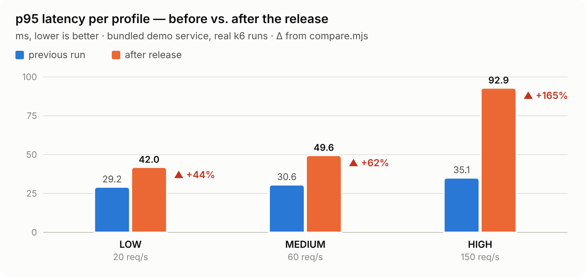
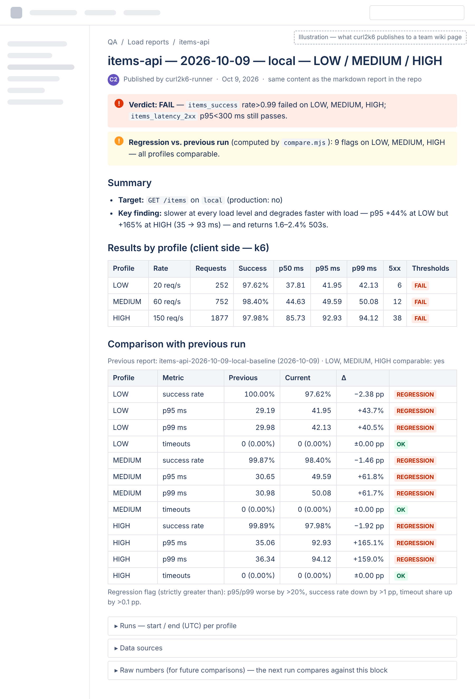

# curl2k6 — k6 load testing & performance-regression checks for Claude Code

[](https://github.com/talikbaku/curl2k6/actions/workflows/test.yml)


**Paste a curl (or a HAR, Postman or OpenAPI request). Get a k6 load test, a report, and a computed verdict: did this release get slower?**

> **Start here (2 min, no Claude needed):**
> `git clone https://github.com/talikbaku/curl2k6.git && cd curl2k6 && bash examples/run-demo.sh` — watch it catch a regression.
> Nothing installed? [](https://codespaces.new/talikbaku/curl2k6?quickstart=1) — k6 and Node are preinstalled; run `bash examples/run-demo.sh` in the terminal.
> Then [use it on your API](#2-use-it-on-your-api).


<sub>Replay of a real Claude Code session: paste a curl, ask "did it get slower?", get the verdict computed by `compare.mjs`. Commands and outputs verbatim, trimmed; waits shortened.</sub>

A [Claude Code](https://docs.claude.com/en/docs/claude-code/overview) plugin (skill + background agent) for QA and performance engineers.

## How it works

1. **Build** — you paste a curl (or point at a HAR file, Postman collection or OpenAPI spec); Claude writes a k6 test in your repo, following the conventions of the load tests you already have.
2. **Run & measure** — on your machine or in **your own CI** (Azure DevOps template included; GitLab, GitHub Actions, Jenkins via your existing pipeline): smoke, then LOW / MEDIUM / HIGH. Client-side numbers from k6, plus server-side numbers from the monitoring you already have (Prometheus, Grafana, Datadog, Elasticsearch, InfluxDB).
3. **Compare** — every next run finds the previous report: deltas per profile and a regression verdict **computed by a script, not by the LLM**. The first run becomes the baseline.
4. **Report** — one fixed template with the comparison inside, written as a **markdown file in your repo** and published to your **team wiki** (Confluence, Azure DevOps Wiki).



Ask again after each release — *"re-run the load test, did it get slower?"* — and the history builds itself.

## No curl? Start from what you already have

| You have | Ask Claude | What happens |
|---|---|---|
| a curl | paste it | the test is built from it |
| a **HAR** from browser DevTools (Network → *Save all as HAR*) | *"load-test the items call from shop.har"* | API calls are listed (static files and preflights hidden), you pick one |
| a **Postman** collection | *"load-test 'List items' from shop.postman_collection.json"* | folders, `{{variables}}` and inherited auth are resolved |
| an **OpenAPI** spec | *"load-test GET /v2/items from openapi.yaml"* | Claude picks the operation and fills parameters from the spec's examples |

**Your tokens never reach the chat.** A HAR carries live cookies and bearer tokens, so Claude doesn't open it — the bundled extractor does, and swaps every secret for an env variable first:

```console
$ node request-from.mjs shop.har --list
shop.har: HAR, 7 request(s), 4 static/preflight hidden (--all shows them)
   1  GET    200 https://shop.example.com/catalog
   5  GET    200 https://api.example.com/v2/items?limit=50
   6  POST   201 https://api.example.com/v2/cart

$ node request-from.mjs shop.har --pick 5
curl 'https://api.example.com/v2/items?limit=50' \
  -H 'Authorization: Bearer '"$API_TOKEN" \
  -H 'Cookie: '"$COOKIE" \
  -H 'Accept: application/json'
secret: header Authorization → $API_TOKEN (the test reads it from the environment; the value was not copied)
secret: header Cookie → $COOKIE (the test reads it from the environment; the value was not copied)
```

## What a report looks like

From [`examples/reports/`](examples/reports/) — real k6 runs against the bundled demo service, before and after a simulated bad release:

<picture>
  <source media="(prefers-color-scheme: dark)" srcset="docs/media/p95-dark.png">
  
</picture>

| Profile | Metric | Previous | Current | Δ | |
|---|---|---|---|---|---|
| LOW | p95 ms | 29.19 | 41.95 | +43.7% | ⚠ regression |
| MEDIUM | success rate | 99.87% | 98.40% | −1.46 pp | ⚠ regression |
| HIGH | p95 ms | 35.06 | 92.93 | +165.1% | ⚠ regression |
| HIGH | timeouts | 0 (0.00%) | 0 (0.00%) | ±0.00 pp | ✓ |

Every report follows one template — verdict, per-profile p50/p95/p99, 2xx-only latency, errors and timeouts, comparison, runs, data sources — and ends with a machine-readable **Raw numbers** block that the next run compares against. → [baseline report](examples/reports/items-api-2026-10-09-local-baseline.md) · [regression report](examples/reports/items-api-2026-10-09-local-regression.md)

The same report, published to the team wiki:



<sub>Illustration: the same report as a Confluence page (mock-up, not a screenshot).</sub>

## Why not just ask Claude to write a k6 script?

The script is the easy part. This plugin handles what breaks around it:

- **The verdict is computed, not eyeballed by an LLM.** `compare.mjs` applies fixed, configurable rules (p95/p99 worse by >20%, success rate down by >1 pp, timeout share up by >0.1 pp) and is unit-tested — including the float edge case at exactly 20%.
- **No apples-to-oranges.** Different environment, load or duration → *not like-for-like*; a missing field → *cannot be confirmed*; missing data stays `n/a`, never 0. None of these is ever called a regression.
- **Production runs need explicit confirmation** — every run, one profile at a time, with an automatic stop when results look like an incident.
- **Secrets stay in env vars.** Never written into tests, commits or reports; HAR and Postman imports get tokens and cookies swapped for `$ENV` placeholders before anything reaches the conversation; the Azure template scrubs them from published artifacts, validates pipeline parameters and only loads hosts you allow.
- **Your stack, your history.** Runs in your CI, reads your monitoring, writes to your wiki and repo — no vendor cloud, and every report is a reviewable file in git.
- **Fits the repo it lands in.** Mirrors the auth, naming and profile style of load tests you already have instead of inventing a new one.
- **Handles known traps:** CI jobs that go green before k6 finishes, profile variables that silently stay at the old value, unit mix-ups between backends, a run that sends zero requests and still "passes".

### How it compares

Grafana's mcp-k6 helps an assistant write, validate and run k6 scripts; Grafana Cloud k6's test comparison compares runs inside Grafana Cloud. curl2k6 needs no Grafana Cloud account: it runs k6 locally or in your existing CI, pulls server-side numbers from the Prometheus, Grafana, Datadog or Elasticsearch you already have, keeps every report as a versioned markdown file in your repo, and leaves the "did it get slower?" call to a zero-dependency script you can also gate a pipeline on — the LLM never decides it.

## Supported

| | |
|---|---|
| **Input** | curl · HAR (any browser's DevTools) · Postman collection v2.0 / v2.1 · OpenAPI / Swagger spec — one request per test |
| **Run** | **locally** — verified · **Azure DevOps** — hardened pipeline template + `az` recipe, verified on one real organization ([checklist](docs/azure-devops.md); Linux/macOS agents with bash, and GitHub access or a preinstalled k6) · **GitLab CI, GitHub Actions, Jenkins** — Claude drives your team's existing pipeline with generic instructions; no bundled templates yet, and only GitLab has been used in practice (with an earlier version) |
| **Metrics** | k6 summary (always, no backend needed) · Prometheus / VictoriaMetrics / Thanos / Mimir · Grafana · Datadog (MCP or API) · Elasticsearch / Kibana / OpenSearch · InfluxDB |
| **Reports** | markdown file · Confluence or any wiki Claude has a connector for · Azure DevOps Wiki (via `az devops wiki`) — written in English by default |

What has and hasn't been verified against real systems: [GUIDE §14](docs/GUIDE.md#14-what-has-and-hasnt-been-verified).

## 1. See it catch a regression

Requires Node.js ≥ 22 and [k6](https://grafana.com/docs/k6/latest/set-up/install-k6/). No Claude, no CI.

```bash
git clone https://github.com/talikbaku/curl2k6.git && cd curl2k6
bash examples/run-demo.sh          # baseline → "bad release" → tables + comparison + verdict
```


## 2. Use it on your API

Install in Claude Code:
```
/plugin marketplace add talikbaku/curl2k6
/plugin install curl2k6@curl2k6
```

<details><summary>Manual install (without the plugin system)</summary>

```bash
mkdir -p ~/.claude/skills ~/.claude/agents
cp -R plugins/curl2k6/skills/curl2k6 ~/.claude/skills/
cp plugins/curl2k6/agents/curl2k6-runner.md ~/.claude/agents/
```
</details>

Then:
```
/curl2k6 here's the curl: curl -H 'Authorization: Bearer <TOKEN>' https://api.stage.example.com/v2/items?limit=50
— stage, LOW/MEDIUM/HIGH, report to load-reports/ and Confluence
```

(`/curl2k6:curl2k6` if another installed skill has the same name.) Or just paste a curl and ask for a load test — or point at a file: *"load-test the 'List items' request from api.postman_collection.json"* (also a HAR saved from DevTools, or an OpenAPI spec). Later, *"we shipped a release — re-run the load test and tell me if it got slower"* (in any language) picks up the existing test and the last report.

What happens:
1. Claude asks what it needs in one block — repo, environment, local or CI, metrics backends, profiles, report destination, where tokens live.
2. It shows the draft test; nothing is committed until you agree (on CI it opens an MR by default).
3. It finds the previous report and tells you which one is the baseline.
4. It runs the profiles (on CI in the background via the `curl2k6-runner` agent) and writes the report.

### Profiles and defaults

| Profile | Load (requests/s) | Duration | Purpose |
|---|---|---|---|
| smoke | 1 | 20 s | proves the target answers (status codes, auth) before a real profile |
| low | ramp to 5 | ~5.5 min | light load |
| medium | ramp to 20 | ~6.5 min | moderate load |
| high | ramp to 50 | ~7.5 min | heavy load |

Defaults the skill offers — sized to your service on request ("profiles 10 / 50 / 200 req/s"). k6 thresholds: success rate > 99%, p95 of 2xx responses < 500 ms, at least one request sent. Regression rules: p95/p99 worse by > 20%, success rate down by > 1 pp, timeout share up by > 0.1 pp — change them in plain words ("regression if p95 is worse by 10%") or with `compare.mjs` flags.

### Scope and limits

- **One endpoint per test.** Built from one request (a curl, a HAR entry, a Postman request or an OpenAPI operation). ID/credential pools are supported; multi-step flows (login → token → call) are not generated automatically — ask Claude to extend the script.
- **One run against one run.** No statistical model of run-to-run noise. On shared environments the report says a difference is a signal, not proof — re-run before concluding.
- **Baseline:** the most recent matching report by default. Pin an accepted baseline by naming it ("compare with load-reports/orders-api-2026-09-01-stage-low.md") or passing it to `compare.mjs --prev`.
- **What Claude asks before acting:** committing the test, every production run (one profile at a time), creating CI pipelines. It never asks you to paste a token and doesn't start extra runs after the report.

### Use in CI without Claude

`to-raw.mjs` and `compare.mjs` are zero-dependency Node scripts — copy them next to your k6 test (from `plugins/curl2k6/skills/curl2k6/scripts/`) and gate any pipeline on a pinned baseline. GitHub Actions example:

```yaml
on:
  workflow_dispatch:
    inputs:
      profile: { type: choice, options: [smoke, low, medium, high], default: low }
permissions: { contents: read }
jobs:
  load:
    runs-on: ubuntu-latest
    steps:
      - uses: actions/checkout@v4
      - uses: actions/setup-node@v4
        with: { node-version: 22 }
      - uses: grafana/setup-k6-action@v1
        with: { k6-version: '2.3.0' }
      - name: k6 run                       # inputs go through env — never pasted into the script
        env: { LOAD_PROFILE: "${{ inputs.profile }}", API_TOKEN: "${{ secrets.API_TOKEN }}" }
        run: mkdir -p out && k6 run -e TARGET_ENV=stage -e OUT_DIR=out load/orders.js 2>&1 | tee out/k6.log
      - name: Regression gate              # runs even when k6 thresholds failed the previous step
        if: always()
        env: { FORCE_COLOR: '1' }
        run: |
          node load/to-raw.mjs out/summary-*.json --format json > out/raw.json
          node load/compare.mjs --prev load-reports/baseline.md --curr out/raw.json --format text --fail-on-regression
```

`--fail-on-regression` exits 1 only for regressions on comparable profiles; exit 2 means bad input (the message says which). `--format text` prints an aligned, coloured table for CI logs.

## Development

```bash
npm test                         # unit tests (node --test, no install step)
bash examples/run-demo.sh low    # quick end-to-end check
```

Repo layout, the full flow and all options: [docs/GUIDE.md](docs/GUIDE.md). Issues and PRs welcome — especially real-world reports from GitLab CI / GitHub Actions / Jenkins and backends not yet verified. **Roadmap:** hardened pipeline templates for GitHub Actions, GitLab CI and Jenkins (same protections as the Azure template).

## License

[MIT](LICENSE) © 2026 Talat Gurbanbayov
