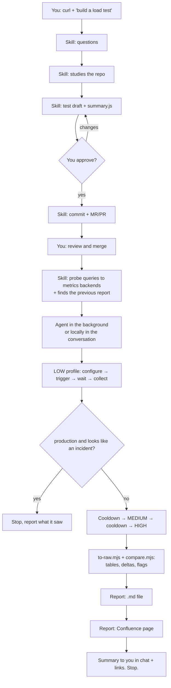

# curl2k6 for Claude Code — detailed guide

Version 1.2. Skill `curl2k6` + agent `curl2k6-runner` + two deterministic scripts (`to-raw.mjs`, `compare.mjs`).

You give Claude a curl, and it does the rest: writes a k6 load test, runs it locally or on your CI across several load profiles (LOW / MEDIUM / HIGH by default), collects metrics from whatever monitoring you have, compares the result with the previous run, and writes a report to a markdown file and/or a Confluence page (or another wiki).

---

## Contents

1. [What's in the repo](#1-whats-in-the-repo)
2. [What it can and can't do](#2-what-it-can-and-cant-do)
3. [What you need before you start](#3-what-you-need-before-you-start)
4. [Installation](#4-installation)
5. [How it all fits together — diagram](#5-how-it-all-fits-together--diagram)
6. [The process, step by step](#6-the-process-step-by-step)
7. [What you end up with — all artifacts](#7-what-you-end-up-with--all-artifacts)
8. [The report: markdown file and Confluence page](#8-the-report-markdown-file-and-confluence-page)
9. [Comparison with the previous run](#9-comparison-with-the-previous-run)
10. [Metrics backends: what's supported and what you need to provide](#10-metrics-backends-whats-supported-and-what-you-need-to-provide)
11. [CI: how runs are triggered](#11-ci-how-runs-are-triggered)
12. [Production safety rules](#12-production-safety-rules)
13. [Common problems](#13-common-problems)
14. [What has and hasn't been verified](#14-what-has-and-hasnt-been-verified)
15. [FAQ](#15-faq)

---

## 1. What's in the repo

```
curl2k6/
├── .claude-plugin/marketplace.json        ← makes the repo installable as a plugin marketplace
├── plugins/curl2k6/
│   ├── .claude-plugin/plugin.json
│   ├── agents/curl2k6-runner.md           ← the agent: long CI runs
│   └── skills/curl2k6/
│       ├── SKILL.md                       ← the skill itself: questions, test draft, rules
│       ├── templates/
│       │   ├── test-template.js           ← k6 test skeleton (smoke/low/medium/high)
│       │   ├── summary.js                 ← monitoring-independent k6 run summary + planOf()
│       │   ├── report.md                  ← report template
│       │   └── azure-pipelines.yml        ← Azure DevOps pipeline (runtime parameters, artifact)
│       ├── scripts/
│       │   ├── to-raw.mjs                 ← summaries/logs → results + Runs tables + Raw numbers block
│       │   └── compare.mjs                ← deterministic comparison with the previous report
│       └── references/
│           ├── metrics-backends.md        ← query recipes for metrics backends
│           └── ci-azure-devops.md         ← Azure DevOps recipe (az commands, traps, wiki)
├── examples/                              ← local demo: demo service, test, example reports, Azure demo pipeline
├── tests/                                 ← unit tests (node --test) · azure/ — offline Azure Pipelines checks
├── docs/GUIDE.md                          ← this guide
├── docs/azure-devops.md                   ← first-run checklist for Azure DevOps
└── CHANGELOG.md
```

**Who does what:**

| Component | Role | Where it runs |
|---|---|---|
| **Skill `curl2k6`** | Everything that needs a conversation with you: questions, studying the repo, drafting the test, the MR, probe queries to metrics backends, finding the previous report; short local runs | In your main Claude conversation |
| **Agent `curl2k6-runner`** | The long mechanical part: running profiles on CI, waiting, collecting metrics, comparing, writing the report | In the background, asks you nothing |
| `templates/summary.js` | Goes into the test; prints the final numbers so they can be found anywhere, and records the planned load (`planOf`) | Inside k6 |
| `scripts/to-raw.mjs`, `scripts/compare.mjs` | All report arithmetic: results tables, Raw numbers block, deltas, regression flags, comparability — no numbers are computed in prose | Node.js, called by the skill/agent |
| `templates/report.md` | Report structure — the same every time | Used by the agent |
| `references/metrics-backends.md` | Ready-made queries for Prometheus, Grafana, Datadog, Elasticsearch/Kibana, InfluxDB | Read by the skill and the agent |

You need **both** the skill and the agent for CI runs: the skill hands the run off to the agent.

---

## 2. What it can and can't do

### It can

- Write a k6 test from a curl or an endpoint description. If the repo already has load tests, it follows their style: auth, metric names, profiles, how they're triggered.
- Build useful metrics into the test from the start: success rate and response time for all requests and for **successful (2xx) requests only**, a separate timeout counter, 4xx and 5xx separately.
- Pick a random user/ID from a pool if the endpoint needs per-user auth.
- Open an MR/PR with the test (yes by default), so the code is reviewed before anything runs.
- Run several profiles locally or on CI one after another, with a cooldown in between, and wait until each one has really finished.
- Collect numbers:
  - **always** — the k6 run summary (no monitoring system needed);
  - **additionally** — time series and server-side metrics from Prometheus / VictoriaMetrics / Thanos / Mimir, Grafana, Datadog, Elasticsearch / Kibana / OpenSearch, InfluxDB.
- Compare with the previous report for the same test: deltas, regression flags, and a check that the runs are comparable at all — computed by `scripts/compare.mjs`, so the same inputs always give the same verdict.
- Write the report using one fixed template to a markdown file and/or a Confluence page (another wiki works if Claude has a connector for it).
- Follow strict safety rules for production (section 12).

### It can't / won't

- **Run anything without your confirmation** of the draft — and on production, without a separate confirmation for every run.
- **Set up CI from scratch — except on Azure DevOps.** On Azure DevOps it adds `azure-pipelines.yml` from the bundled template and creates the pipeline (after your confirmation). For other CIs it suggests a local run or helps you write a pipeline as separate work.
- **Create tokens or ask you to paste them into the chat.** Tokens must already be somewhere it can read them from (git remote, environment variable).
- **Guess its way into a metrics system that isn't on the list.** For those you get the k6 summary only.
- **Make decisions for you** after the report: it won't do "one more run to double-check" or file bugs on its own.

---

## 3. What you need before you start

| What | Required? | Why |
|---|---|---|
| Claude Code | yes | — |
| Node.js ≥ 22 | yes | Runs `to-raw.mjs` / `compare.mjs` (no npm packages needed) |
| A repo where the test will live | yes | The test code is written there and the MR is opened there |
| API access to CI from your machine | to run on CI | Token in the git remote URL or in an environment variable (`GITLAB_TOKEN`, `GH_TOKEN`, …), VPN if the CI is internal. `glab` / `gh` make life easier but aren't required |
| k6 on your machine | only for local runs | `brew install k6` / [other OSes](https://grafana.com/docs/k6/latest/set-up/install-k6/) |
| A Confluence connector in Claude (Atlassian MCP) | if you want the report in Confluence | Without it you get the markdown file only |
| Access to a metrics backend | no, but strongly recommended | URL + token in an environment variable, or the Datadog MCP |
| Test data | if the endpoint needs auth | A pool of user IDs / tokens — a file, a query, or a list |

**Environment variables for metrics backends** (you tell Claude only the variable *name*; it never sees the value):

| Backend | What's needed |
|---|---|
| Prometheus / VictoriaMetrics / Thanos / Mimir | URL; a token if auth is enabled |
| Grafana | URL + a service-account token with the Viewer role, e.g. `GRAFANA_TOKEN` |
| Datadog | A connected Datadog MCP **or** `DD_API_KEY` + `DD_APP_KEY` and your site (`datadoghq.com`, `datadoghq.eu`, …) |
| Elasticsearch / OpenSearch | ES (or Kibana) URL, login/token, index name |
| InfluxDB | URL + database |

How to set a variable without showing it to Claude: in a **separate terminal**, `export GRAFANA_TOKEN=...` before starting `claude`, or put it in `~/.zshrc`.

---

## 4. Installation

### Option 1. Plugin (recommended)

In Claude Code:
```
/plugin marketplace add <your-github-username>/curl2k6
/plugin install curl2k6@curl2k6
```
Restart Claude Code if prompted. The skill is invoked as `/curl2k6` (or `/curl2k6:curl2k6` if another skill has the same name); the agent is `curl2k6:curl2k6-runner`. You can also skip the slash command and just describe the task.

**Updates:** `/plugin marketplace update curl2k6`.

For a team fork: change the files, bump `version` in `plugins/curl2k6/.claude-plugin/plugin.json`, push; teammates run the update command.

### Option 2. By hand

```bash
git clone https://github.com/<your-github-username>/curl2k6.git
mkdir -p ~/.claude/skills ~/.claude/agents
cp -R curl2k6/plugins/curl2k6/skills/curl2k6 ~/.claude/skills/
cp curl2k6/plugins/curl2k6/agents/curl2k6-runner.md ~/.claude/agents/
```
Restart Claude Code. To check: type `/curl` — `/curl2k6` should appear in the suggestions. Downside: updates have to be copied by hand.

### Try it without Claude first

```bash
bash examples/run-demo.sh
```
Runs LOW / MEDIUM / HIGH against a bundled demo service, then against a "bad release" of it, and prints the report sections and the regression verdict — about two minutes. Needs Node.js and k6.

## 5. How it all fits together — diagram



---

## 6. The process, step by step

### Step 0. Starting

Type in Claude Code, for example:

> `/curl2k6` here's the curl: `curl -H 'Authorization: Bearer …' https://api.stage.example.com/v2/items?limit=50` — need a load test, stage, LOW/MED/HIGH, report to Confluence

You can skip `/curl2k6` — the skill is picked up from the meaning ("build a load test from this curl").

> ⚠ If the curl contains a real token — no disaster, Claude won't save it into the code, but it's better to replace it with `<TOKEN>` before pasting.

### Step 1. Questions (skill, §0)

Claude asks its questions in one block. What it will ask and how to answer:

| # | Question | Example answer | If you don't know |
|---|---|---|---|
| 1 | curl / endpoint description | already given | — required |
| 2 | Repo / folder for the test | `~/work/my-load-tests` | It suggests creating a folder |
| 3 | Production or not | "stage" | It infers from the URL and **asks again**; production needs a separate confirmation |
| 4 | Where to run | locally / GitLab CI / GitHub Actions / Jenkins / Azure DevOps | It first looks in the repo (`.gitlab-ci.yml`, `.github/workflows`, `Jenkinsfile`, `azure-pipelines.yml`) |
| 5 | Where to get metrics + **where k6 actually runs** | "Grafana at grafana.company.com, token in `GRAFANA_TOKEN`; k6 runs in a k8s pod" | It first looks for hints in the repo (`PROMETHEUS_URL`, `DD_SITE`, Grafana/Kibana links in README, helm, CI) and tells you what it found |
| 6 | Load profiles | "defaults" or your own numbers | It suggests 3 tiers but **won't pick large numbers blindly** — it asks about SLOs / previous results |
| 7 | Open an MR/PR? | "yes" | Yes by default |
| 8 | Where to put the report | "md in `reports/`, and Confluence, space QA, under the page 'Load tests'" | Markdown file only if there's no wiki connector — and it tells you so |
| 9 | How to get tokens | "token in the git remote URL" / "`GITLAB_TOKEN`" / "variable group in Azure Library" | It will **never** ask you to paste a token into the chat |
| 10 | Regression thresholds | "defaults" | Defaults: p95/p99 worse by >20%, success rate down by >1 pp, timeout share up by >0.1 pp |

Why "where does k6 actually run" matters: if the CI job only *launches* k6 somewhere else (e.g. in a Kubernetes pod), a green CI job **does not mean** the test has finished, and the final numbers won't be in the CI log. Claude needs to know where to look for them.

### Step 2. Studying the repo (skill, §1)

Claude looks for existing load tests (`k6`, `artillery`, `locust`, …). If it finds some, it mirrors:
- the auth approach,
- metric names,
- profile shape,
- report format,
- how runs are triggered on CI.

If there are none, it proposes sensible defaults and **asks** before writing anything.

### Step 3. Load profiles (skill, §2)

Default proposal:
```
LOW:    ramp to a light load over ~5 min
MEDIUM: ramp to a moderate load over ~6 min
HIGH:   ramp to a heavy load over ~7 min, each with a short ramp-down at the end
```
Concrete numbers (VUs / requests per second, p95 / success-rate thresholds) are sized for your service — you confirm or change them.

### Step 4. Test draft (skill, §3)

Claude writes the test from `templates/test-template.js` (or your repo's style) and puts `summary.js` next to it. The test contains:
- a random user/ID from the pool (if auth is needed);
- per-endpoint metrics: success rate, response time (all requests), response time (2xx only);
- a timeout counter separate from 4xx/5xx;
- thresholds with the agreed values;
- `summaryTrendStats` including `p(99)` (k6 doesn't compute p99 by default);
- `handleSummary` from `summary.js` with the test's metadata — test name, environment, endpoint, profile, commit and the **planned load** (`planOf(options)`: executor, target rate or peak VUs, planned duration). That metadata is what makes the next comparison possible. At the end of the run it:
  - prints a table of numbers,
  - prints one line `K6_SUMMARY_JSON {...}` — greppable in CI logs, pod logs, Kibana, Datadog Logs,
  - writes `summary.json` and `summary-<profile>.json` (into `OUT_DIR` if set — the folder must exist, k6 doesn't create it; if the files are missing, `to-raw.mjs` can read the `K6_SUMMARY_JSON` line from the saved k6 log instead);
- if you have a Prometheus-compatible store or InfluxDB — it adds `--out` to the run command so k6 sends metrics there during the run.

Then it **shows you a short description** of what the test does. Nothing is committed until you agree.

### Step 5. MR/PR and review

After your "ok", Claude:
1. creates a branch,
2. commits the test, `summary.js`, and the ID pool file (if any),
3. opens an MR/PR.

You (or a colleague) review and merge. The run starts **after the merge**.

### Step 6. Preparing the run (skill, §5 and §5a)

Before handing off to the agent, the skill:

1. **Sends a probe query to each metrics backend** (e.g. the last 5 minutes of one metric). If one doesn't answer, it drops it from the plan and tells you: "Datadog didn't respond (403), continuing without it".
2. **Looks for the previous report** for this test (section 9). Tells you which report will be the comparison baseline, or that this is the first (baseline) run.
3. **Builds the full plan for the agent**: repo, how to trigger CI, where to get the token (variable name, not value), profiles and cooldowns, where to read the k6 summary, exact queries for each metrics backend, where to write the report, the path to the report template and to the previous report.

### Step 7. Running the profiles (agent, or locally)

For a local run the skill can run the profiles itself (`k6 run -e LOAD_PROFILE=low …`). For CI the agent works in the background. For **each** profile:

1. **Sets the CI variables** that select the profile (e.g. `LOAD_PROFILE=low`) **right before** triggering. This guards against a real bug: if the variable is left over from a previous run, LOW can silently run as HIGH.
2. **Triggers** the run — tag + pipeline, API call, CLI — as agreed.
3. **Waits for completion** with short checks (one check at a time, no long `sleep` — some environments forbid `sleep`). If CI only launches k6 somewhere else, it waits for completion there, not for the green CI job.
4. **Collects numbers** for the exact run window (UTC start/end ±1 min):
   - the k6 summary (`K6_SUMMARY_JSON` / `summary.json`) — always;
   - then each metrics backend using the queries it was given. If one fails, it notes that in the report and carries on;
   - converts everything to milliseconds; keeps client-side (k6) and server-side (service/APM) numbers in separate sections.
5. **On production** — checks the result before the next profile: ordinary degradation under load → continues; looks like an incident (success rate collapsing, broad blocking) → **stops** and reports what it saw.
6. **Cooldown** between profiles (usually 5 min). The agent doesn't sit idle: it fills the time with work — pulling metrics, writing report sections — and checks elapsed time by the clock.

### Step 8. Numbers and comparison (scripts)

`to-raw.mjs` turns the `summary-<profile>.json` files into the results tables and the Raw numbers block; `compare.mjs` compares that with the previous report. See section 9.

### Step 9. Report (agent)

See section 8. Markdown file first, then the wiki page with the same content.

### Step 10. Summary and stop

The agent posts to the chat: what ran, key numbers, the verdict, and links to everything created (pipelines, report file, Confluence page). **Then it stops.** If it noticed something suspicious, it mentions it as an observation but won't run anything on its own.

---

## 7. What you end up with — all artifacts

| Artifact | Where | Created by | When |
|---|---|---|---|
| k6 test (`*.js`) | your repo | skill | step 4 |
| `summary.js` | next to the test | skill | step 4 |
| ID / test-data pool (`*.json`) | next to the test, if needed | skill | step 4 |
| Branch + MR/PR | your git hosting | skill | step 5 |
| CI pipelines / jobs — one per profile | your CI | agent | step 7 |
| `K6_SUMMARY_JSON` line and `summary.json` | CI log/artifact, pod logs | k6 | at the end of each profile |
| Report `.md` | the folder you specified | agent | step 9 |
| Confluence / wiki page | the space and parent page you specified | agent | step 9 |
| Final message with links | Claude chat | agent | step 10 |

---

## 8. The report: markdown file and Confluence page

### Where it goes

- **Markdown file** — always first, into the folder you named in step 1. If writing to the wiki fails, the file stays.
- **Confluence page** (or another wiki) — same content converted to the wiki's format, in the given space under the given parent page. Needs a Confluence connector in Claude (Atlassian MCP). Without it you get the file only, and Claude tells you upfront.

**Title:** `<test name> — <YYYY-MM-DD> — <environment> — <profiles>`, e.g.
`orders-api — 2026-10-08 — stage — LOW / MEDIUM / HIGH`.

### Structure (template `templates/report.md`)

| Section | Contents |
|---|---|
| **Summary** | Verdict PASS / FAIL / PARTIAL and why; endpoint and environment; test path and commit; MR; the key finding in 1–3 plain sentences |
| **Results by profile** | Per-profile table: peak VUs, duration, request count, success rate, p50/p95/p99/max, timeouts, 4xx, 5xx, thresholds. Plus p95/p99 for successful (2xx) requests only, if noticeably different |
| **Over time** | When latency/errors started to grow: minute into the run and the load level at that moment (if time series are available) |
| **Server side** | Server-side p95/p99, requests, errors per endpoint; notable correlations (DB, CPU, pod restarts, connection pool). Facts separate, hypotheses labelled as hypotheses |
| **Comparison with previous run** | Section 9 |
| **Runs** | Start/end time of each profile (UTC) and a CI link |
| **Data sources** | Where the numbers came from; which backends worked ✓, which didn't ✗ and why |
| **Raw numbers** | JSON with all per-profile numbers (+ which latency metric, executor, target rate; unknown = `null`) — for automatic comparison next time |
| **Appendix — queries used** | Every query executed, with its time window — so anyone can re-check the numbers |

Rule: **numbers are never invented**. A section without data is omitted or says why there's no data.

---

## 9. Comparison with the previous run

### How the previous report is found (skill)

1. If you said where it is — that one is used.
2. Otherwise Claude searches itself — the markdown report folder and the wiki (under the same parent page / in the same space) — by test name (ignoring `.js` / `-test`) **and** by endpoint.
3. **Each candidate is checked by its content:** same script/test, **same environment**, same endpoint. A name match isn't enough: e.g. searching for `orders` would also find reports of an `orders-export` test or of a *different* script on *stage* — and comparing production with stage is meaningless. Files that aren't reports (raw metric dumps, empty notes) are skipped.
4. Reports may be stored **one file per profile** — then for each profile the most recent matching one is used (a later re-run of a single profile replaces the baseline for that profile only).
5. If several equally plausible candidates remain for a profile, Claude shows them and you choose.
6. Nothing found → this run is the **baseline**: the report says so, with no comparison.

Before the run Claude tells you which report (files) will be the baseline, with date and headline numbers — and that you can pick a different one.

### How the comparison works (`scripts/compare.mjs`)

1. **Previous numbers** come from the `Raw numbers` (JSON) block — `compare.mjs` reads it straight from the markdown report. For older reports without it the script exits with code 2; Claude then parses the tables into a JSON file (unknown = `null`), runs the script on that, and the report says so. The **same latency metric** is compared on both sides (which one is recorded in `latency_metric`).
2. **Gaps are never filled in.** A value missing on either side → **n/a** and no flag. A 0 may be filled in only when it follows unambiguously from the same report (e.g. "100% of responses were 2xx" ⇒ 0 timeouts) — and it's marked as derived.
3. **Comparability.** Core: endpoint, environment, profile load (target rate or peak VUs, planned duration). Secondary: script commit, executor, latency metric.
   - core matches → "Comparable: yes"; differences/gaps in secondary fields are just noted (older reports lack the newer fields — that's not a reason to downgrade the comparison);
   - a core field differs → **"not like-for-like"** + what differs;
   - a core field can't be checked on one side → **"comparable: cannot be confirmed"** + what's missing.
4. **Delta table** per profile: before → after → Δ for success rate, p95, p99, timeouts.
5. **Regression flag** (strictly greater than the threshold; exactly 20% is not flagged), unless agreed otherwise in step 1:

   | Metric | Regression if |
   |---|---|
   | p95 or p99 | worse by **more than 20%** |
   | Success rate | down by **more than 1 percentage point** |
   | Timeout share (timeouts ÷ requests) | up by **more than 0.1 percentage point** |

   "Success rate" = share of requests the test counts as successful (normally 2xx). Timeouts are shown both as a count and as a share.
   Non-comparable runs — flags marked "(not like-for-like)"; unconfirmed — "(unconfirmed)" (in both the markdown and the `--format text` output); in both cases the overall verdict does **not** call it a regression.
7. **Input is validated.** A previous report parsed by hand must use JSON numbers, `success_rate` as a fraction 0..1, and `null` for unknowns. Strings like `"1,234"` or `"99.5%"`, or a file that isn't a curl2k6 raw file (e.g. a k6 `summary.json`), make `compare.mjs` exit 2 with the reason instead of silently printing ✓ or "Baseline run".
6. **Caveat** for production and shared stage environments (stage is treated as shared unless you say it's dedicated): results depend on concurrent traffic; one difference is a signal, not proof; re-run before concluding a regression. (From real experience: two runs of the same test on production a day apart gave MEDIUM p95 of ~4.3 s and ~0.5 s.)

### How this was verified

In v1.2 the rules live in `scripts/compare.mjs` and are covered by unit tests (`npm test`): thresholds at +19% / exactly +20% / +25%, −0.5 / exactly −1 / −1.5 pp, timeout share, `null` handling, not like-for-like, cannot be confirmed, VU-based profiles, one-file-per-profile merging, old reports without a Raw block — including the floating-point trap where `(0.84 − 0.7) / 0.7` is `20.000000000000004%` and must **not** be flagged.

Earlier (v1.1) the same rules were tested with separate runs following the skill/agent instructions, checked against a reference script:

| Scenario | What was checked | Result |
|---|---|---|
| Real older reports without JSON (production, one file per profile) | Table parsing, arithmetic, handling unknown values | ✅ numbers matched the reference |
| New format with JSON, boundary values (+19%, +25%, −0.5 pp, −1.5 pp) | Threshold accuracy | ✅ flags exactly where expected |
| Different environments / profiles | "not like-for-like" label | ✅ |
| Finding the previous report in a folder with 100+ reports of different tests, similar names, "production vs stage" trap | Picking the right files; baseline for a new test | ✅ (after a fix) |
| `Raw numbers` block of a new report | Reads back without loss | ✅ |
| v1.2: `compare.mjs` / `to-raw.mjs` / `summary.js` unit tests | All rules above as code, plus the cases found by the independent review | ✅ `npm test` |
| v1.2: local end-to-end demo | k6 → summaries → tables → comparison against the previous **markdown** report → regression flags | ✅ `examples/reports/` |

---

## 10. Metrics backends: what's supported and what you need to provide

Two layers:

**Layer A — k6 summary. Always works**, even with no monitoring at all. Gives whole-run totals (success rate, p50–p99, max, timeouts, status codes). Doesn't give behaviour over time or the server side.

**Layer B — metrics backends.** Add behaviour over time ("at which minute did things go wrong") and the server side ("what was the DB doing at that moment"). You can use several at once.

| Backend | What it gives | How it's accessed | What to tell Claude |
|---|---|---|---|
| **Prometheus**, VictoriaMetrics, Thanos, Mimir | k6 time series (if k6 pushes there) + service metrics | HTTP API `query_range` | URL; whether auth is enabled |
| **Grafana** | Whatever is behind it (Prometheus, Loki, ES, Influx, …) | Grafana API; best of all — **reuse the query from an existing dashboard panel** | URL, token variable name, name of the dashboard with service metrics |
| **Datadog** | Server side via APM: latency and errors per endpoint, DB queries | Datadog MCP (no keys) or API with keys | Whether the MCP is connected, or key variable names + site; the service name in Datadog |
| **Elasticsearch / Kibana / OpenSearch** | Service access logs → percentiles, status codes, behaviour over time; can also find the `K6_SUMMARY_JSON` line if pod logs are shipped there | ES API directly or through the Kibana proxy | URL, index name, which fields hold response time (and its **unit**), status code, service name |
| **InfluxDB** | k6 time series | k6 `--out influxdb`, InfluxQL | URL and database |
| Nothing / other | Layer A only | — | "nothing" |

### Pitfalls already handled in the recipes

- **Units.** k6 metrics in Prometheus are in **seconds** (0.098 = 98 ms). Datadog trace metrics are in **seconds**. Datadog span `@duration` is in **nanoseconds**. ECS `event.duration` (Elasticsearch) is in **nanoseconds**. The report normalizes everything to ms.
- **Datadog metric names** depend on the tracer (`trace.http.server.request`, `trace.http.request`, `trace.servlet.request`, …) — Claude looks up the real name first instead of guessing.
- **Elasticsearch:** a filter on a text field (`service.name`) silently returns 0 — you need `service.name.keyword`.
- **Grafana:** the datasource is often set on the panel, not on the query.
- **Datadog straight from k6:** k6 no longer has a built-in `statsd` output (removed in v0.55). So for Datadog the server side (APM) + the k6 summary are used.
- **A whole-window percentile** in Datadog is an average of per-interval p95s; look at the time series for peaks.

---

## 11. CI: how runs are triggered

There's no hard-wired integration: Claude works with your CI the same way you would from a terminal — via the API (`curl`), `glab`, `gh`, the Jenkins API. So any CI reachable from your machine will do.

Worth knowing:
- **The token** is taken from where you said it lives (git remote URL, environment variable). It's never printed, committed, or put into the report.
- **Profile-selecting variables** are set afresh before every run.
- **"Launcher" jobs.** If the CI job only dispatches k6 somewhere else (a Kubernetes pod, a separate runner, the cloud), it goes green within a minute while the test keeps running for several more. The agent waits for completion where k6 actually runs (k6 dashboard, pod logs, `k6_vus` metric = 0).
- **Runner queues.** If an image build is waiting for a free runner, the agent waits rather than re-triggering.
- **Local runs** ("no CI for now") are possible too — you need k6 on your machine.

Proven in practice on GitLab CI. GitHub Actions and Jenkins follow the same general rules, but there have been no real runs yet (section 14).

### Azure DevOps

Dedicated support: `templates/azure-pipelines.yml` (runtime parameter `profile` with `values: [smoke, low, medium, high]`, `onThresholds` fail|warn, checksum-verified k6 install, parameters passed as validated env vars with every `$` stripped, `baseUrl` limited to `ALLOWED_HOSTS` set in the YAML, secrets scrubbed from every published file, artifact `curl2k6-<profile>`) and `references/ci-azure-devops.md` (the `az` commands Claude uses). Azure-specific traps it handles:
- **A variable from the YAML `variables:` block can't be overridden at queue time** — `--variables LOAD_PROFILE=high` is silently ignored. Profiles are selected with runtime parameters (`az pipelines run --parameters profile=high`), and the downloaded summary's `meta.profile` is checked against the request.
- Azure runs the YAML and the test **from the remote branch** — push before creating/running the pipeline.
- Microsoft-hosted agents reach only public URLs — and even a public API may IP-allowlist them (observed: Cloudflare `403 Your IP address is not allowed`); use the pool the team's other pipelines use. Internal services need a self-hosted pool.
- A new pipeline may wait for a permission approval on first use (`notStarted`) — approve in the UI, don't queue again.
- Secret variables must be mapped into the step's `env:` explicitly.

First real run checklist: `docs/azure-devops.md`.

---

## 12. Production safety rules

These rules **cannot be switched off** in the skill:

1. Production tests are **read-only** unless you explicitly say otherwise and confirm it's been agreed with the service owner.
2. **Every production run needs its own explicit confirmation** in the current conversation. A "go" from the start of the conversation doesn't count. If Claude's safety system blocks an action, Claude doesn't retry it — it explains what was blocked and waits for a specific confirmation.
3. **After each profile** — the result is checked. Looks like an incident → stop, without moving on to the next profile.
4. **After the report — stop.** No "I'll re-run it to be sure" unless you ask.

Before a production run, warn the service owners / on-call — this is not done automatically.

---

## 13. Common problems

| Symptom | Cause | What to do |
|---|---|---|
| LOW ran at HIGH load | The profile variable was left over from the previous run | The agent sets it before every run; if your CI passes variables to child pipelines oddly, set it at project level |
| CI is green after a minute, but there are no numbers | CI only launches k6 somewhere else | Tell Claude in step 1 where k6 actually runs |
| No p99 in the report | The test has no `summaryTrendStats` with `p(99)` | The skill adds it itself; add it to older tests |
| Latencies in the report are 1000× too large/small | Units mixed up | The recipes normalize to ms; for a non-standard system, state the units |
| "Datadog didn't respond, continuing without it" | No permissions / wrong site / no MCP | Check the keys or the MCP connection; the report is still built from the k6 summary |
| Elasticsearch returns 0 although the data is obviously there | Filter on a `text` field | Use `.keyword` (the recipe accounts for this) |
| `jslib.k6.io` unreachable from CI/k8s | No outbound internet | `summary.js` has no external dependencies |
| The agent "hangs" on a long wait | `sleep` is forbidden somewhere | The agent already polls with short checks; if it seems stuck, ask for status — it continues from the current CI state |
| A production action was blocked by the safety system | The confirmation was too generic | Give a specific one: "yes, run HIGH on prod for orders-api now" |
| Report only in the file, nothing in Confluence | No Atlassian MCP connection or no rights on the space | Connect the MCP / check permissions; the file always remains |
| Comparison says "not like-for-like" | Profiles / script / environment changed | That's fine — the numbers are shown, but draw conclusions carefully |

---

## 14. What has and hasn't been verified

| What | Status | How it was checked |
|---|---|---|
| k6 summary (`summary.js`) | ✅ verified | Real k6 v1.5 runs (public test site; bundled demo service) |
| Report numbers + comparison (`to-raw.mjs`, `compare.mjs`) | ✅ verified | Unit tests + local end-to-end demo |
| Local runs | ✅ verified | `examples/run-demo.sh` |
| The skill inside Claude Code | ✅ verified (local runs) | Headless Claude Code sessions with the plugin, fresh repo: curl → test → run → report; then "re-run, did it get worse?" in English and in Russian → skill picked up, previous report found, `compare.mjs` used, regression reported. Found and fixed along the way: re-run requests didn't trigger the skill; a missing `OUT_DIR` silently dropped the summary files; the report pointed at a commit made before the test |
| Prometheus-compatible (VictoriaMetrics) | ✅ verified | k6 → VictoriaMetrics in Docker → `query_range`; p95 matched k6 |
| Grafana | ✅ verified | Grafana in Docker: a direct API query and a query taken from a dashboard panel |
| Datadog via MCP | ✅ verified | Real data: the window of a real load-test run, server-side p95 per endpoint |
| Datadog via API keys | ⚠ not verified | Recipe based on the docs |
| Elasticsearch / Kibana | ✅ verified, on synthetic data | ES + Kibana in Docker, generated access logs |
| InfluxDB | ⚠ not verified | Recipe only |
| GitLab CI | ✅ proven in practice | Many real runs (full chain) |
| GitHub Actions / Jenkins | ⚠ not verified | General instructions |
| Azure DevOps | ✅ verified on a real organization | Demo pipeline on a Microsoft-hosted agent; real API run (LOW + MEDIUM) on an autoscaled self-hosted pool with a variable-group secret, report to repo + Azure DevOps Wiki. Fixes from that run are in the recipe (IP-allowlisted APIs vs hosted agents, `Checkpoint.Authorization` for variable groups, list-valued secrets, wiki paths, commit-email policy VS403702). Offline checks stay in `tests/azure/`. Not yet re-run on real Azure: the `onThresholds=fail` default (emulated) |
| Confluence | ✅ in practice (with an earlier version of the skill) | Same logic here; the report template is newer |
| Comparison with the previous report | ✅ verified | Unit tests + 4 scenarios on real reports (v1.1); a full "CI → report → comparison" run with the v1.2 template hasn't been done on CI yet |

**Recommendation:** do your first run on stage and watch it — especially if you're not on GitLab or not on Prometheus/Datadog.

---

## 15. FAQ

**Can I run it without CI, just locally?**
Yes. In step 1 answer "run it locally". You need k6 installed. Keep in mind that a laptop can itself become the bottleneck at HIGH. To see the whole flow first, run `bash examples/run-demo.sh`.

**Can it just write the test without running it?**
Yes. Say "just write the test and open an MR" — the agent never gets involved.

**One profile instead of three?**
Yes, any profiles in any order — agree on them in step 3.

**Can CI fail the pipeline on a regression?**
Yes: `node scripts/compare.mjs --prev <last report> --curr raw.json --fail-on-regression` exits 1 only for regressions on comparable profiles.

**Custom regression thresholds?**
Say so in step 1, e.g. "regression if p95 is worse by 10%" or "any increase in timeouts".

**Notion / Google Docs instead of Confluence?**
If that system is connected to Claude, say where; if not, you get the markdown file.

**Where are my tokens?**
Only where you put them yourself. Claude refers to them by variable name and never prints the value.

**Can I adapt the skill for my team?**
Yes: these are plain text files. Fork the repo, change what you need, bump `version` in `plugin.json`; teammates install from your fork.
